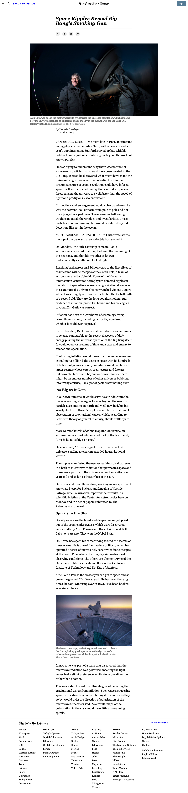

# Positioning and floating elements project

## Description
This project aims to mimic the layouts of elements from a NY Times article. 

## Screenshot

Project from [the Odin Project](https://www.theodinproject.com/paths/full-stack-ruby-on-rails/courses/html-and-css/lessons/positioning-and-floating-elements)
